# Rune Breaker
This project aims to test the effectiveness of one of MapleStory's anti-botting mechanisms: the rune system. To accomplish this, a model that can solve runes with an accuracy of **97.82%** was created.

The project provides an end-to-end pipeline that encompasses every step necessary to replicate this model. Additionally, the article below goes over all the details involved in the development process. Toward the end, it also considers possible improvements and alternatives to the current rune system. Make sure to read it.

## Summary
1. [Introduction](#introduction)
    - [What are runes?](#what-are-runes)
    - [What is the challenge?](#what-is-the-challenge)
    - [How can it be solved?](#how-can-it-be-solved)
2. [The Pipeline](#the-pipeline)
    - [Overview](#overview)
    - [Labeling](#labeling)
    - [Preprocessing](#preprocessing)
    - [Dataset](#dataset)
    - [Classification model](#classification-model)
3. [Results and Interpretations](#results-and-interpretations)
    - [Final results](#final-results)
    - [Further improvements](#further-improvements)
4. [Final Considerations](#final-considerations)

## Introduction
MapleStory is a massively multiplayer online role-playing game published by Nexon and available in many countries around the world.

### What are runes?
In an attempt to protect the game from botting, MapleStory employs a kind of [CAPTCHA](https://en.wikipedia.org/wiki/CAPTCHA) system. From time to time, a rune is spawned somewhere on the player's map. When the user walks into it and presses the activation button, the game displays a panel containing four arrows. See an example below.

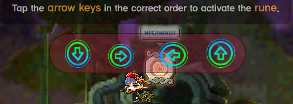

The player is then asked to type the direction of the four arrows. If the directions are correct, the rune disappears and the player receives a buff. However, if the user does not activate it within a certain amount of time, they will stop receiving any rewards for hunting monsters, hampering the performance of bots that cannot handle runes.

That said, our goal is to create a computer program capable of determining the direction of the arrows when given a game screenshot.

### What is the challenge?
If arrows were static textures, it would be possible to apply a template matching algorithm and reliably determine the arrow directions. Interestingly, that is how runes were initially implemented.

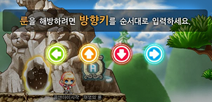

Nevertheless, the game was later [updated](http://maplestory.nexon.net/news/24928/updated-v-188-tune-up-patch-notes) to add randomness to the arrows. For instance, both the position of the panel and the position of the arrows within it are randomized. Moreover, every color is randomized and often mixed in a semi-transparent gradient. Finally, there are four different arrow shapes, which then suffer rotation and scaling transformations.

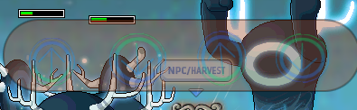

As shown in the picture above, these obfuscation mechanisms can make it hard to determine the arrow directions, even for humans. Together, these techniques make it more difficult for machines to define the location, the shape, and the orientation of the arrows.

Is it possible to overcome these challenges?

### How can it be solved?
As we have just discussed, there are several layers of difficulty that must be dealt with to enable a computer program to determine the arrow directions. With that in mind, splitting the problem into different steps is a good idea.

First, the program should be able to determine the location of each arrow on the screen. After that, the software should classify them as **down**, **left**, **right**, or **up**.

#### Locating the arrows
Some investigation reveals that it is possible to determine the location of the arrows using less sophisticated techniques. Even though this task can be performed by an artificial neural network, the simplest option is to explore solutions within traditional computer vision.

#### Classifying the arrow directions
On the other hand, classifying arrow directions is a great candidate for machine learning solutions. First of all, each arrow could fit inside a grayscale 60×60×1 image, which is a relatively small input size. Moreover, it is very convenient to gather data, since it is possible to generate 32 different sample images for each screenshot. The only requirement is to rotate and flip each of the four arrows in the screenshot.

## The Pipeline
In this section, we will talk about how it is possible to organize a sequence of operations that uses a set of game screenshots to create a program that classifies rune arrows. Let's start with an overview.

### Overview
First, we should define two pipelines: the **model pipeline** and the **runtime pipeline**. See the diagram next.

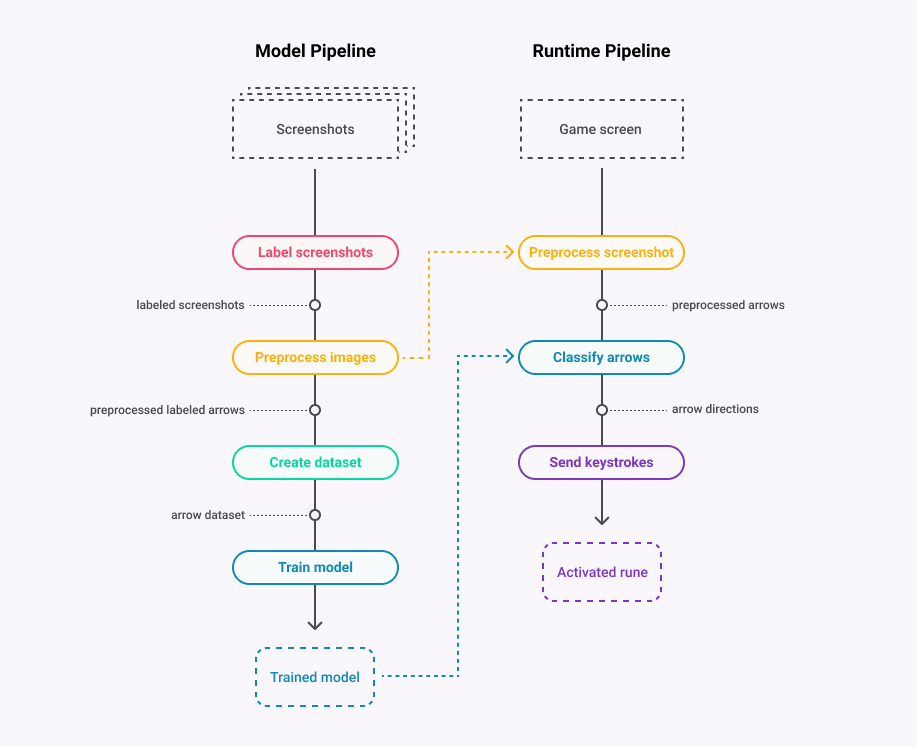

The model pipeline is responsible for taking a set of screenshots as input and perform a sequence of steps to create an arrow classification model. On the other hand, the runtime model represents a hypothetical botting software. This software would use parts of the model pipeline in addition to the trained classifier to activate runes during the game runtime.

Considering the purposes of this project, only the model pipeline will be discussed. 

Each step of this pipeline will be thoroughly explained in the sections below. Also, the experimental results obtained during the development of this project will be presented.

### Labeling
First, we should collect game screenshots and label them according to the direction and shape of the arrows. To make this process easier, the [`label.py`](./preprocessing/label.py) script was created. The next figure shows the application screen.

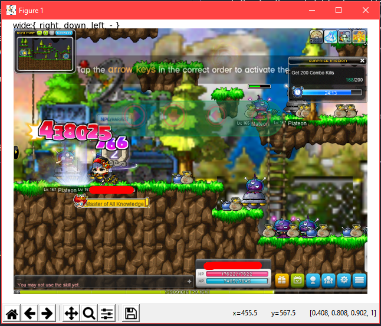

When run, the program iterates over all images inside the `./data/screenshots/` directory. For each screenshot, the user should press the arrow keys in the correct order to label the directions and `1`, `2`, or `3` to label the arrow shape.

There are four different types of arrows, which can be arranged within three groups, as shown below.

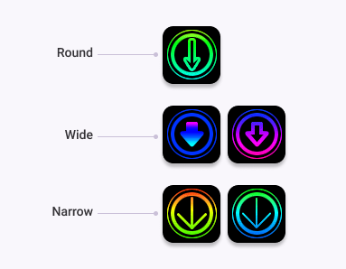

This distinction is made to avoid problems related to data imbalance. This topic will be better explained later on in the [dataset](#dataset) section. Before we proceed, notice that there are two types of arrows inside the **full** category. This choice was made based on the similarity between both shapes. Since they are similar, there should be no problem in doing so.

After a screenshot is labeled, the application moves it to another folder. Finally, the file is renamed with a name that contains its labels and a unique id (e.g. `full_rdlu_123.png`, where each letter in `rdlu` represents a direction).

### Preprocessing
With our screenshots correctly labeled, we can move to the preprocessing stage.

Simply put, this step is responsible for locating the arrows within the labeled screenshots and producing preprocessed output images. These images are the arrow samples that will feed the classification model later on.

This process is handled by the [`preprocess.py`](./preprocessing/preprocess.py) script. Its internals can be visualized through the following diagram.

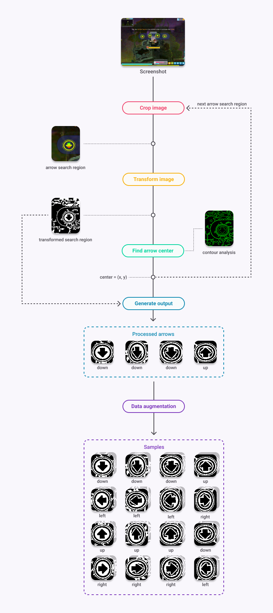

Each screenshot undergoes a sequence of transformations that simplify the image in several aspects. Next, the transformed image is analyzed and the position of each arrow is determined. Lastly, the script generates the output samples.

Let's examine each one of these operations individually.

#### Cropping
Our first objective is to make it easier to find the location of the arrows within a screenshot. Consider the following input image.

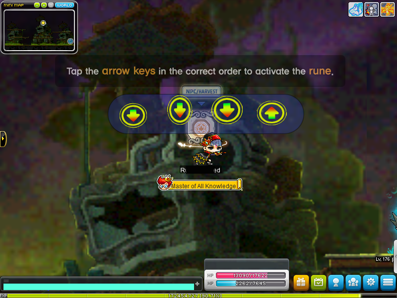

The input has a width of 800 pixels, a height of 600 pixels, and 3 RGB color channels (800×600×3 = 1,400,000), which is a considerable amount of data to be processed. This makes detecting objects difficult and may ultimately harm the accuracy of our model. What can be done to overcome this obstacle?

One alternative relies on processing each arrow separately. We can accomplish this by first restricting the search to a small portion of the screen. Next, the coordinates of the leftmost arrow are determined. After that, these coordinates are used to define the next search region. Then, the process repeats until all arrows have been found. This is possible because, although the positions of the arrows are random, they still fall within a predictable zone.

This is the first search region for our input image:

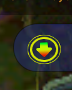

As can be seen, the search problem has been reduced to an image much smaller than the original one (120×150×3 = 54,000). However, the resulting picture still has three color channels. This issue will be addressed next.

#### Transforming the input
The key to identifying the arrows is [edge detection](https://en.wikipedia.org/wiki/Edge_detection). Nevertheless, as pointed earlier, the applied obfuscation makes this process difficult. What transformations can we apply to an image to make it easier to locate the arrows?

Let's reflect on how a human can identify the outlines of the arrows despite the obfuscation. After some thought, we may realize that two important factors in this process are the differences in color and intensity between the arrows and the background. 

Knowing this, we can isolate this information. To do so, we will convert the cropped image to the HSV format and then to grayscale. The figure below shows the result of this operation.

> Note: Gaussian Blur was also applied to the image to mitigate possible noise.

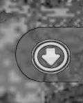

Although the new image has only one channel instead of three (120×150×1 = 18,000), the outlines of the arrow can still be identified. We have roughly the same information with fewer data. This same result is observed in several other examples, even if at different degrees.

However, we can still do more. Each pixel in the current image now ranges from 0 to 255, since it is a grayscale image. In a binarized image, on the other hand, each pixel is either 0 (black) or 255 (white). In this case, the contours are objectively clear and can be easily processed by an algorithm.

Since the image has many variations of shading and lighting, the most appropriate way to binarize it is to use adaptive thresholding. Fortunately, [OpenCV](https://opencv.org/) provides this functionality, which can be configured with several parameters. Applying this algorithm to the grayscale image produces the following result.

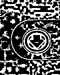

The current result is already considerably positive. Yet, notice that there are some small "patches" scattered throughout the image. In theory, these spots constitute noise and could impair the process of detecting the contours of the image. To avoid any problems, we can use the morphology operations provided by the [skimage library](https://scikit-image.org/) to remove these undesired connected components of pixels. The next figure shows the resulting image.

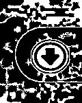

The image is now ready to be analyzed. Next, we will discuss the details of the algorithm that determines the position of the arrow.

#### Locating the arrow
The first step of the process consists in computing the contours of the image. To do this, an algorithm is used to transform the edges in the image into sets of points, forming many polygons. See the figure below.


Each polygon constitutes a different contour. But then, how to determine which contours belong to the arrow? It turns out that directly identifying the arrow is not the best alternative. Frequently, the obfuscation heavily distorts the outline of the arrow, which makes identifying it very difficult.

Fortunately, some outlines are much simpler to identify: the circles that surround the arrow. There are two reasons for this. First, these contours tend to keep their shape intact despite the obfuscation. Second, circumferences have much clearer morphological characteristics.

Still, another question remains. How to identify these circles then? There are *several* ways to solve this problem. One of the first alternatives that may come to mind is the [Circle Hough Transform](https://en.wikipedia.org/wiki/Circle_Hough_Transform). Unfortunately, this method is known to be unstable when applied to noisy images. Preliminary tests confirmed that this method produces unreliable results for our input images. Because of this, I decided to use morphological analysis instead.

##### Algorithm
Our goal is to determine which contours correspond to the surrounding circles and then calculate the position of the arrow, which sits in the middle of these circles. To do this, we can use the following algorithm.

1. First, the program removes all contours whose area is too small or too large compared to a real surrounding circle.

2. Then, a score is calculated for each remaining contour. This score is based on the difference between the contour, a perfect ellipse, and a perfect circle.

3. Next, starting with a low threshold `t`, `t` is incremented until there is at least one contour with difference score less than `t`.

4. Finally, a coordinate is calculated based on the position of all contours whose score is smaller than `t`. This coordinate corresponds to the the arrow center.

The code snippet below illustrates the process.

```py
candidates = [c for c in contours if area(c) > MIN and area(c) < MAX]

surrounding_circles = []

t = initial_threshold
while not surrounding_circles and t < min_threshold:
    for candidate in candidates:
        if score(candidate) < t:
            surrounding_circles.append(candidate)

    t += step

(center_x, center_y) = mean_centroid(surrounding_circles)
```

##### Difference/similarity score
The key to the accuracy of the operation above is the quality of the score. Its principle is simple: the surrounding circles tend to resemble a perfect circumference more than other objects do. With that in mind, it is possible to measure the likeliness that a contour is a surrounding circle using the following metrics.

1. The difference between the convex hull of the contour and its minimum enclosing ellipse. Considering that the area of the ellipse is larger:
```
d1 = (area(ellipse) - area(hull)) / area(ellipse)
```

2. The difference between the minimum enclosing ellipse and its minimum enclosing circle. Considering that the area of the circle is larger:
```
d2 = (area(circle) - area(ellipse)) / area(circle)
```

The resulting score is the arithmetic mean of these two metrics. 
```
score = (d1 + d2) / 2
```

By doing so, the closer a contour is to a perfect circle, the closer the score will be to zero. The more distinct, the closer it will get to 1.

##### Arrow center
The fourth and last step consists in determining the center of the arrow. The algorithm computes the centroid of each enclosing ellipse among the selected contours and returns their average. If there are no contours, it returns the center of the search region instead, which makes the operation much more reliable.

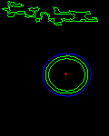

Of course, there are errors associated with this algorithm. Sometimes, the operation yields false positives due to the obfuscation, causing the center of the arrow to be defined incorrectly. In some cases, these errors are significant enough to prevent the arrow from being in the output image, as we will see next. Nevertheless, these cases are rather uncommon and have a small impact on the accuracy of the model.

Finally, as we have previously mentioned, the coordinate returned by the algorithm is then used to define the next search region, as shown below.

<p align="center">
    (x<sub>search</sub>, y<sub>search</sub>) = (x<sub>center</sub> + <strong>d</strong>, y<sub>center</sub>)
</p>

#### Generating the output
After finding the positions, the program should generate an output. To do so, it first crops a region around the center of each arrow. The dimension of the cropped area is 60×60, which is just enough to fit an arrow. See the results in the next figure.

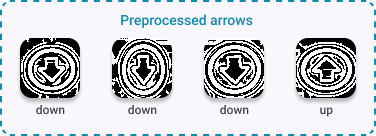

But, as mentioned earlier, we can augment the output by rotating and flipping the arrows. By doing this, we both multiply the sample size by **eight** and eliminate class imbalance, which is extremely helpful. The next figure shows the 32 generated samples.

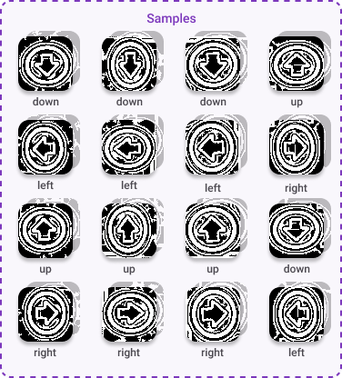

#### Application interface
Before discussing experimental results, let's talk about the preprocessing application interface. When the user runs the script, it displays the following window for each screenshot in the `./data/labeled/` folder.

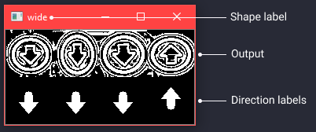

For each one of them, the user is given the option to either process or skip the screenshot. If the user chooses to process it, the script produces output samples and places them inside the `./data/samples` folder.

The user should skip a screenshot when the transformations applied to the image corrupts an arrow, or when the algorithm misses its location. See a couple of examples.

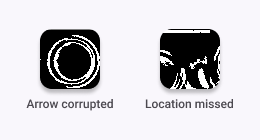

#### Results
Using 655 labeled screenshots as input and following the guidelines mentioned in the previous section, the following results were obtained.

```
Approved 642 out of 655 images (98%).
```
**Samples summary**
|            |  Down |  Left |  Right |  Up   | Total |
|------------|------:|------:|-------:|------:|------:|
| **Hollow** |  1640 |  1640 |  1640  |  1640 |  6560 |
| **Full**   |  1976 |  1976 |  1976  |  1976 |  7904 |
| **Thin**   |  1520 |  1520 |  1520  |  1520 |  6080 |
| **Total**  |  5136 |  5136 |  5136  |  5136 | 20544 |

In other words, the preprocessing had an accuracy of 98.02%. Plus, there are now 20,544 arrow samples that we can use to create the dataset that will be used by the classification model. Amazing!

### Dataset
In this step of the pipeline, the objective is to divide the generated samples into training, validation, and testing sets. The produced dataset will then be used to train the arrow classification model. Note that the quality of the dataset has a direct impact on the performance of the model. Thus, it is essential to perform this step correctly.

Let's start by defining and understanding the purpose of each set.

#### Training set
As the name suggests, this is the dataset that will be directly used to fit the model in the training process.

#### Validation set
This is the dataset used to evaluate the generalization of the model and to optimize any hyperparameters the classifier may use.

#### Testing set
This is the set used to determine the final performance of the model.

With these definitions in place, let's address some issues.

One of the main obstacles that classification models may face is data imbalance. When the training set is asymmetric, the model may not generalize well, which causes it to perform poorly for the underrepresented samples. Therefore, the training set should have an (approximately) equal number of samples from each shape and direction.

Additionally, it is necessary to define the proportion of samples in each set. An (80%, 10%, 10%) division is usually a good starting point.

The [`make_dataset.py`](./model/make_dataset.py) script is responsible for creating a dataset that meets all the criteria above. Running the script with the settings below produces the following results.

```
$ python model/make_dataset.py -r 0.9
```
**Training set**
|            | Down | Left | Right |   Up | Total |
|------------|-----:|-----:|------:|-----:|------:|
| **Hollow** | 1368 | 1368 | 1368  | 1368 | 5472  |
| **Full**   | 1368 | 1368 | 1368  | 1368 | 5472  |
| **Thin**   | 1368 | 1368 | 1368  | 1368 | 5472  |
| **Total**  | 4104 | 4104 | 4104  | 4104 | 16416 |

**Validation set**
|            | Down | Left | Right |  Up | Total |
|------------|-----:|-----:|------:|----:|------:|
| **Hollow** | 136  | 136  | 136   | 136 | 544   |
| **Full**   | 304  | 304  | 304   | 304 | 1216  |
| **Thin**   | 76   | 76   | 76    | 76  | 304   |
| **Total**  | 516  | 516  | 516   | 516 | 2064  |

**Testing set**
|            | Down | Left | Right |  Up | Total |
|------------|-----:|-----:|------:|----:|------:|
| **Hollow** | 136  | 136  | 136   | 136 | 544   |
| **Full**   | 304  | 304  | 304   | 304 | 1216  |
| **Thin**   | 76   | 76   | 76    | 76  | 304   |
| **Total**  | 516  | 516  | 516   | 516 | 2064  |

Notice that the training set is perfectly balanced on both axes. You can also see that the split between sets follows approximately (80%, 10%, 10%).

Now that the dataset is ready, we can move on to the main stage: the construction of the classification model.

### Classification model
In this stage, the dataset created in the previous step is used to adjust and train a machine learning model that classifies arrows into four directions when given an input image. The trained classifier can be applied in the runtime pipeline to determine the arrow directions within the game.

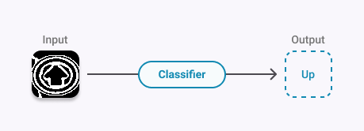

To quickly validate the viability of the idea, we can use [Google's Teachable Machine](https://teachablemachine.withgoogle.com/train/image), which allows any user to train a neural network image classifier. An experiment using only **1200** arrow samples results in a model with an overall accuracy of **90%**. It is quite clear that a classification model based on a neural network is feasible. 

In fact, we could export the model trained by Google's tool and call it a day. However, since each rune has four arrows, the total accuracy is 66%.

Fortunately, there is plenty of room for improvement. For instance, this model transforms our 60×60×1 input into 224×224×3, making the process much more complex than it needs to be. Additionally, Google's tool lack many configuration options.

With this in mind, the best alternative is to create a model from scratch.

### Building the model
Our model will use a convolutional neural network (CNN), which is a type of neural network widely used for image classification.

We will use Keras to create and train the model. Take a look at the code that generates the structure of the neural network.

```py
def make_model():
    model = Sequential()

    # Convolution block 1
    model.add(Conv2D(32, (3, 3), padding='same', input_shape=(60, 60, 1)))
    model.add(Activation('relu'))
    model.add(MaxPooling2D(pool_size=(2, 2)))

    # Convolution block 2
    model.add(Conv2D(48, (3, 3), padding='same'))
    model.add(Activation('relu'))
    model.add(MaxPooling2D(pool_size=(2, 2)))

    # Convolution block 3
    model.add(Conv2D(64, (3, 3), padding='same'))
    model.add(Activation('relu'))
    model.add(MaxPooling2D(pool_size=(2, 2)))

    model.add(Flatten())

    model.add(Dense(64, activation='relu'))
    model.add(Dropout(0.2))

    model.add(Dense(4, activation='softmax'))

    model.compile(optimizer='adam',
                  loss='categorical_crossentropy',
                  metrics=['accuracy'])

    return model
```

The architecture was inspired by one of the best performing MNIST classification models on [Kaggle](https://www.kaggle.com/). While simple, it should be more than enough for our purposes.

### More data augmentation
In addition to rotation and flipping, as we saw earlier, we can apply other transformations to the arrow samples. We should do this to help reducing overfitting, especially regarding the position and size of the arrows.

Keras provides this and many other functionalities out-of-the-box. Using an image data generator, we can automatically augment the data from both training and validation sets during the fitting process. See the code snippet below, which was taken from the training script.

```py
aug = ImageDataGenerator(width_shift_range=0.125, height_shift_range=0.125, zoom_range=0.2)
```

### Training the model
With that set, we can fit the model to the data. The [`train.py`](./model/train.py) script is responsible for this and other processes.

Based on a few input parameters, the script creates the neural network, performs data augmentation, fits the model to the data, and saves the trained model to a file.

Moreover, to further improve the performance of the resulting model, the program applies mini-batch gradient descent and early stopping.

Running the following command, we obtain the results below.
```
$ python model/train.py -m binarized_model128.h5 -b 128

...

Settings
           value
max_epochs   150
patience      75
batch_size   128

Creating model...

Creating generators...
Found 16416 images belonging to 4 classes.
Found 2064 images belonging to 4 classes.

Fitting model...

...

Epoch 131/150
 - 23s - loss: 0.0093 - accuracy: 0.9973 - val_loss: 5.5879e-09 - val_accuracy: 0.9974

...

Best epoch: 131

Saving model...
Model saved to ./model/binarized_model128.h5

Finished!
```

The next figure shows the accuracy and loss charts for this training session.

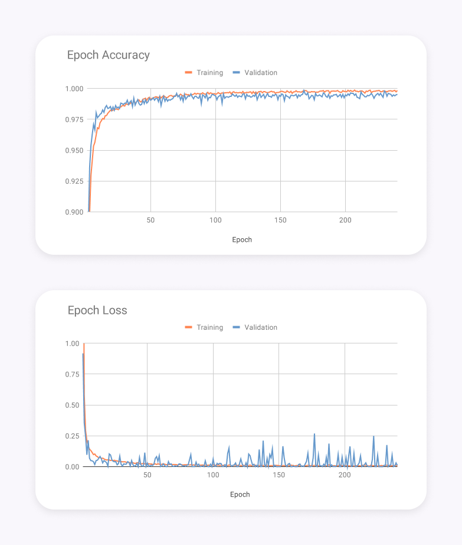

As we can see, the model had a **99.74%** accuracy in the best epoch for the validation set. Looking at the charts, we can also notice that the training process was quite stable.

## Results and Interpretations
Now that our model has been trained and validated, it is time to evaluate its performance using the testing set. In the sections below, we will show some metrics calculated for the classifier and make some considerations upon them.

> You can access the complete results [here](./results.txt).

### Performance
To calculate the performance of the model, we can run the [`classify.py`](./model/classify.py) script with the following parameters.
```
$ python model/classify.py -m binarized_model128.h5 -d testing
```
**Confusion matrix**
|           | Down | Left | Right |  Up |
|-----------|-----:|-----:|------:|----:|
| **Down**  | 516  | 0    | 0     | 0   |
| **Left**  | 0    | 516  | 0     | 0   |
| **Right** | 1    | 0    | 515   | 0   |
| **Up**    | 0    | 0    | 0     | 516 |

**Classification summary**
|           | Precision | Recall |     F1 |
|-----------|----------:|-------:|-------:|
| **Down**  | 0.9981    | 1.0000 | 0.9990 |
| **Left**  | 1.0000    | 1.000  | 1.0000 |
| **Right** | 1.0000    | 0.9981 | 0.9990 |
| **Up**    | 1.0000    | 1.0000 | 1.0000 |

**Classification summary**
|            | Correct | Incorrect | Accuracy |
|------------|--------:|----------:|---------:|
| **Hollow** | 544     | 0         | 1.0000   |
| **Full**   | 1215    | 1         | 0.9992   |
| **Thin**   | 304     | 0         | 1.0000   |
| **Total**  | 2063    | 1         | 0.9995   |

Notice the F1 scores and the accuracy per arrow type. Both of them are balanced, which means that the model is not biased toward any shape or direction.

The results are remarkable. With only a single error in the training set, the model was capable of correctly classifying an arrow **99.95%** of the time! Now, let's calculate the overall accuracy of the pipeline.

| Preprocessing    | Four arrows      | Total    |
|------------------|------------------|----------|
| 0.9802           | 0.9995⁴ = 0.9980 | 0.9782   |

In other words, the pipeline is expected to solve a rune **97.82%** of the time. That is roughly equivalent to only a single mistake for every fifty runes. Amazing!

> **Note: similar results may be accomplished with much less than 655 screenshots!**

#### Biases
For the sake of integrity, we must understand some of the underlying biases behind the result we just saw. The *real* performance can only be measured in practice.

For instance, the input screenshots are slightly biased toward the maps and situations in which they were taken, even though they are significantly diverse.

Moreover, remember that some of the screenshots were filtered during the preprocessing stage. The human interpretation of whether or not an arrow is corrupted may influence the resulting metrics.

Also, when a screenshot is skipped, it is assumed that the model would not be able to solve the rune, which is not always the case. There is still a probability that the model correctly classifies an arrow 'by chance' (25% if you consider it a random event).

Nonetheless, these sources of bias are not significant for the current application and can be safely disregarded.

### Further improvements
There is always room for improvement. Despite the remarkable results obtained by the model, we could still perform some optimizations and increase the accuracy of the pipeline up to **99%** or more. Let's examine some possibilities below.

#### Tweaking denoising parameters
About half of the screenshot discards during the preprocessing stage were caused by the corruption of arrow outlines. Also, many errors made by the classifier happened due to the same reason. This phenomenon is related to the denoising transformation, which may sometimes remove pixels from the arrows. Using different denoising parameters could increase both the preprocessing and classification accuracy. However, be aware that changes in these parameters could cause the algorithm to fail in cases it currently works. Thus, any tweaks should be appropriately measured.

#### Applying machine learning
As mentioned at the beginning of this article, it is also possible to predict the location of the arrows using a neural network. This neural network would have the transformed search region as input and would replace the ["locating the arrow"](./#locating-the-arrow) step.

Since this task allows for a considerable margin of error, this model could probably identify 100% of the arrows. Nevertheless, the performance gain would be small, since the current preprocessing accuracy is around 98%. Additionally, it is considerably more difficult to label samples and perform data augmentation compared to the arrow classification model.

#### Alternative preprocessing output
Instead of using binarized images, we can convert the search region into HSV and isolate the hue channel. The following figure illustrates the output of this operation.

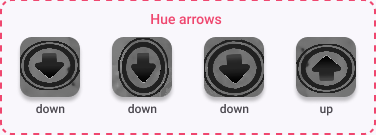

By doing this, we eliminate the preprocessing errors caused by the corruption of the outlines. Nevertheless, this comes at the expense of making the input of the neural network more complex, since it now works with grayscale images.

Using the same 655 screenshots as before, we obtain the following results for the alternative model.

| Preprocessing    | Four arrows      | Total    |
|------------------|------------------|----------|
| 0.9925           | 0.9922⁴ = 0.9692 | 0.9619   |

Despite the greater preprocessing accuracy, the lower classification accuracy makes it a slightly less accurate model overall. Moreover, it requires much more data to reach this accuracy in comparison to the current model. Thus, until improvements are made, it is better to stick with the model that uses thresholded images.

> Note: you can use this mode using the **-m hue** flag when running the [preprocessing.py](./preprocessing/preprocess.py) script.

#### Better model and parameters
Between all components of the pipeline, the architecture and parameters of the classification model were possibly the least tested. Although the current neural network already produces satisfactory results, there are still several options to explore. Therefore, both classification models could be improved, especially the one that takes grayscale images as input. Specifically, the trends presented by the accuracy and loss charts suggest that we could achieve better results by extending the dataset, increasing the number of epochs, and tweaking the learning rate.

#### Template matching
Finally, let's talk about template matching. As mentioned earlier, this approach was significantly affected by the update that introduced obfuscation in the rune system. Yet, experiments have shown that template matching is capable of determining the position of arrows in a screenshot using only one template image. Thus, an algorithm based on this technique may yield good results for both location and direction classification if it is adjusted to use different sample images.

## Final Considerations
With a moderate amount of work, we created a model capable of solving runes **97.82%** of the time. Additionally, we have seen several ways of improving this result even further. We have also seen that template matching, which is supposedly the main target of the obfuscation update, can still be used to some extent. But what do these results tell us?

### Conclusion
First of all, we proved that current artificial intelligence technology is capable of bypassing this CAPTCHA system with ease, which makes us wonder whether the current rune system is better than the previous one. 

Considering that there have been multiple complaints from the player base (including colorblind people) regarding the obfuscation methods used, it is clear that there are significant usability drawbacks. Are the shortcomings worth the 2.18% error rate of the model, which is comparable to human performance?

While it is true that we had to develop a new model from scratch, one would expect it to be more elaborate than the one we created. Also, it is debatable whether the rune system update had a significant impact on the botting ecosystem. Even if a perfect model existed, bot developers would still have to create an algorithm or a hack to move the character to the rune, which is already a problem by itself. Moreover, commercially available botting tools have been immune to visual gimmicks since runes first appeared. As we will see, they do not need to process any image.

Therefore, we are left with two issues. First, the current CAPTCHA system hurts user interaction without providing significant security benefits. Second, it seems to be ineffective toward some of the botting software out there.

### How to improve it?
The solution to the first problem is straightforward: reduce or remove the semi-transparency effects and use colorblind-friendly colors only. Regarding the model developed in this project, the solution is also simple: surround the arrows with multiple shapes instead of circles only (although it could still be circumvented using [machine learning](applying-machine-learning)).

The second issue, on the other hand, is trickier. Recent advancements in AI technology have been closing the gap between humans and machines. It is no coincidence that traditional CAPTCHAs have disappeared from the web in the last years. Despite that, there are still some opportunities that can be explored. Let's see some of them.

#### Overall improvements
The changes proposed next may enhance both the quality and security of the game, regardless of the anti-botting system used. 

> Note: this is only a small subset of the improvements that the game may implement. For example, behavioral data from botting accounts can be used to detect other botters.

##### Dynamic difficulty
An anti-botting system should keep a healthy balance between user-friendliness and protection against malicious software. To do so, it could reward successes while penalizing failures. For example, if a user correctly answers a rune, the next ones could contain fewer arrows. On the other hand, the game could propose a harder challenge if someone (or some program) makes many mistakes in a row.

In addition to this, the rune delays should be adjusted. Currently, no matter how many times a user fails to solve a rune, the delay between activations is only five seconds. A better alternative is to increase the amount of time exponentially after a certain amount of errors. By doing so, it is much harder for an attacker to collect data from the game. As a side effect, this measure also impairs the performance of inaccurate models that need several attempts to solve a rune.

##### Better robustness
Currently, the game client is responsible for both generating and validating rune challenges, which allows hackers to perform code/packet injection and forge rune validation. Because of this, botting tools can bypass this protection system without processing the game screen, as we have mentioned previously.

While it is considerably difficult to accomplish such a feat, which involves bypassing the protection mechanisms of the game, this vulnerability is enough to defeat the purpose of the runes to a significant extent.

One way to solve this issue is to move both generation and validation processes to the server. By doing so, the server would forward the image of the generated CAPTCHA through the network, while the client would be responsible for sending back the user input. Thereby, the only possible way to bypass this mechanism would be through image analysis. Although it was reasonably simple to perform image analysis with the current rune system, it is not nearly as trivial with other alternatives like the ones we will discuss next.

#### Alternative systems
Although the changes above could improve the overall quality of the rune system, they alone are not capable of solving its main vulnerability. For this reason, the following alternatives were proposed based on the resources readily available within the game and the capabilities of modern image classifiers.

#### Finding image matches
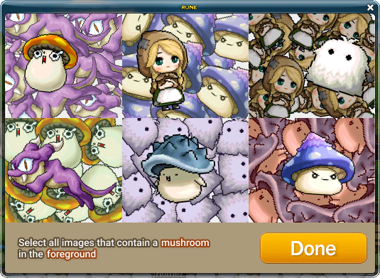

In this system, the user is asked to find all the monsters, NPCs, or characters that match the specified labels.

#### Finding non-rotated images
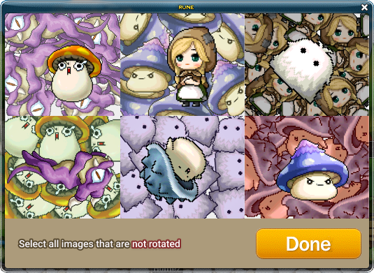

In this system, the user is asked to find all the monsters, NPCs, or characters that are not rotated.

Both systems have their advantages and disadvantages compared to the current one. Let's examine them more closely.

#### Advantages
MapleStory promptly features **thousands** of different sprites, which may be rotated, scaled, flipped, and put in an obfuscated background, resulting in **hundreds of thousands** of different combinations. Thus, when coupled with [better robustness improvements](#better-robustness), the proposed systems could force botting software to be extremely inaccurate, expensive, and possibly impractical. Besides, the first system has an extra advantage since attackers would also have to find out all of the labels that may be specified by the rune system, increasing the cost of developing an automated tool even more.

#### Disadvantages
The proposed systems, especially the first one, are more expensive to implement. Also, the proposed systems are not as universal and easy to solve as the current one, which only requires the user to identify the direction of four arrows. Fortunately, this can be mitigated by employing [dynamic difficulty](#dynamic-difficulty).

---

That concludes the article. I hope you have learned something new. Feel free to open an issue if you have any questions, I will be more than happy to help.
